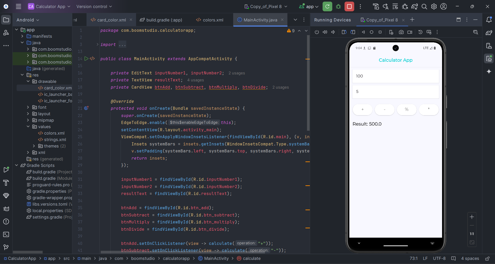

# Simple Calculator App 📱

A sleek and **modern Android calculator app** built using **Java**. This app allows users to perform basic arithmetic operations such as **addition**, **subtraction**, **multiplication**, and **division** with smooth and intuitive UI.

---

## 🌟 Features
- ➕ **Addition** of two numbers  
- ➖ **Subtraction** for accurate results  
- ✖️ **Multiplication** for fast calculations  
- ➗ **Division** with **zero division** handling  
- 🚫 **Input Validation** (Ensures both fields are filled)  
- 🖥️ **Edge-to-edge UI Support** for a full-screen experience

---

## Contact
For any inquiries, please contact [maleezha1975@gmail.com](mailto:maleezha1975@gmail.com).
 
